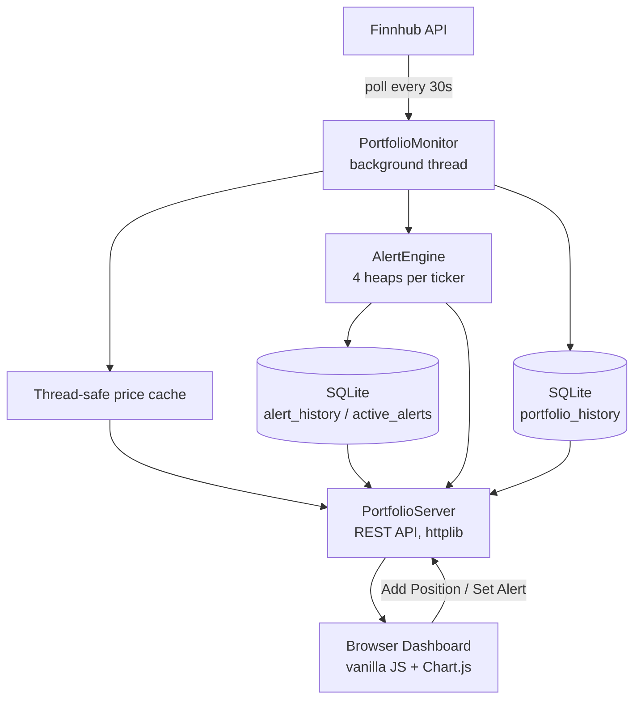

# 📈 Portfolio Engine


A C++ backend that tracks a stock portfolio against live market data, evaluates configurable price alerts, and persists everything to SQLite — paired with a browser dashboard for holdings, P&L, and alert history.

---

## 🧠 System Architecture



**What happens on a price tick:**
1. The monitor thread polls Finnhub for each held ticker every 30 seconds and updates a thread-safe in-memory price cache — so concurrent HTTP requests to `/price` never trigger redundant outbound API calls; they read the cache instead.
2. Each live price is checked against that ticker's alerts via the `AlertEngine`, which keeps four `std::priority_queue`s per ticker (armed/fired × ABOVE/BELOW) instead of scanning every alert on every tick. Only alerts close to triggering or clearing are ever touched — each real state change is an O(log n) heap operation; ticks with no change are O(1) peeks.
3. Triggered alerts and portfolio value snapshots are written to SQLite, with write latency tracked live via `/dbstats`.
4. Alert fire-state and active alerts are reloaded from SQLite on startup, so a restart doesn't lose track of which alerts have already gone off.

---

## ⚙️ Engineering Decisions

**Why a heap-based alert engine instead of scanning every alert.** With a flat list, checking N alerts on every price tick is O(n) work every 30 seconds regardless of whether anything changed. Ordering armed alerts by "how close to triggering" (min-heap for ABOVE, max-heap for BELOW) means `checkAlerts()` only pops the alerts that actually cross a threshold and stops the instant the next one doesn't qualify — since if the easiest candidate doesn't fire, none of the harder ones can either that tick.

**Why alert state survives a restart.** Losing track of which alerts already fired on every restart would mean re-notifying for the same crossing repeatedly. `loadFiredStateFromHistory()` and `loadActiveAlertsFromDB()` rebuild both the alert list and its armed/fired state directly from `alert_history` and `active_alerts` before the monitor thread starts.

**Why the price cache sits in front of Finnhub.** Multiple concurrent requests to `/price` or `/portfolio` for the same ticker would otherwise each make their own outbound call. The monitor thread is the only writer to the cache; HTTP handlers just read it, so a burst of dashboard refreshes costs zero extra API calls between polling cycles.

**Why write latency is instrumented, not assumed.** `Database::exec()` times every write with `std::chrono` and exposes a running average via `/dbstats`, rather than the README quoting a number nobody re-measured.

---

## 📂 Project Structure

```
├── include/
│   ├── alert_engine.h    # Heap-based alert evaluation (4 priority queues per ticker)
│   ├── config.h          # API key loading (file or env var, never hardcoded)
│   ├── database.h        # SQLite schema + write-latency tracking
│   ├── monitor.h         # Background polling thread + thread-safe price cache
│   └── server.h          # REST API (httplib) + endpoint handlers
├── src/
│   └── main.cpp          # Wires everything together, starts the server
├── frontend/
│   ├── Index.html        # Dashboard markup
│   ├── style.css          # Dark glassmorphism UI
│   └── app.js             # Polling, rendering, alert sound/notifications
├── build.bat              # MSVC build script (OpenSSL-linked)
└── .gitignore
```

---

## ▶️ Build & Run (Windows / MSVC)

**Requirements:** Visual Studio Build Tools, OpenSSL for Windows (for HTTPS calls to Finnhub), a free [Finnhub](https://finnhub.io) API key.

1. Create a file named `apikey.txt` next to where `main.exe` will live, containing only your Finnhub API key on one line. (This file is gitignored — it's never committed.) Alternatively, set the `FINNHUB_API_KEY` environment variable.
2. Build:
   ```bash
   build.bat
   ```
3. Run:
   ```bash
   main.exe
   ```
4. Open the dashboard:
   ```
   http://localhost:8080
   ```

---

## 🔌 REST API

| Method | Endpoint | Purpose |
|---|---|---|
| GET | `/price?ticker=X` | Live or cached price for a ticker |
| GET | `/portfolio` | All holdings with live price + P&L |
| GET | `/summary` | Portfolio value, total P&L, best/worst performer |
| POST | `/stock` | Add a position `{ticker, buyPrice, quantity}` |
| POST | `/portfolio/delete` | Remove a position `{ticker}` |
| POST | `/alert` | Create a price alert `{ticker, condition, threshold}` |
| GET | `/activealerts` | List currently armed alerts |
| POST | `/alert/reset` | Re-arm a fired alert |
| POST | `/alert/delete` | Remove an active alert |
| GET | `/alerts` | Triggered alert history |
| POST | `/alert/dismiss` | Remove one entry from alert history |
| GET | `/history?limit=N` | Portfolio value over time (for the chart) |
| GET | `/cachestats` | Price cache hit rate |
| GET | `/dbstats` | Write count + average SQLite write latency |

---

## 📝 Known Limitations

- Price updates are polling-based on a fixed 30-second interval, not push/streaming — "real-time" here means "refreshed every 30s," not sub-second.
- No authentication on the REST API; intended for local/single-user use, not public deployment as-is.
- Windows/MSVC build only, due to the OpenSSL linking setup in `build.bat`.

---

👨‍💻 **Krishna Parmar** — B.Tech ICT, Dhirubhai Ambani University
