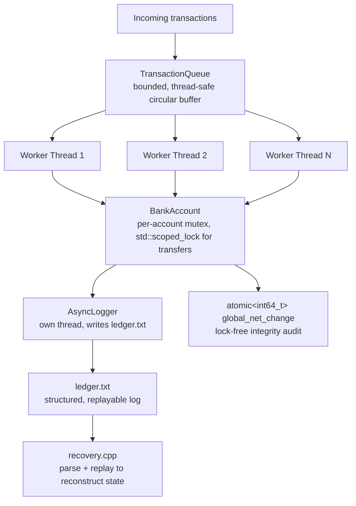

# 🏦 Multithreaded Banking Backend Engine


A concurrent transaction engine that processes thousands of simultaneous account operations with zero data corruption and zero deadlocks — and **provable crash recovery**, not just claimed in a README but actually demonstrated every time the program runs.

---

## 🧠 System Architecture



**What happens to one transaction, start to finish:**
1. It's pushed onto the bounded `TransactionQueue` — if the queue is full, the caller blocks on a condition variable until a worker frees space.
2. One of the fixed worker threads in the pool pops it and executes `deposit`, `withdraw`, or `transfer` on the relevant `BankAccount`(s).
3. Multi-account transfers acquire both accounts' mutexes via `std::scoped_lock`, which uses the standard library's own deadlock-avoidance algorithm — correctness doesn't depend on lock-ordering conventions the caller has to remember.
4. Whether the transaction succeeded or failed, it's handed to the `AsyncLogger`, which appends a structured line to `ledger.txt` on its own dedicated thread — so no worker thread ever blocks on disk I/O.
5. Successful deposits/withdrawals update a single `std::atomic<int64_t>` net-change counter via genuine lock-free `fetch_add`/`fetch_sub` — this is what the end-of-run integrity audit checks against the sum of final balances.

**What happens during recovery:**
`recovery.cpp` reads `ledger.txt` back into structured entries, skipping any malformed trailing line (exactly what you'd expect if the process had crashed mid-write), and replays every `SUCCESS` entry onto a brand-new set of accounts built from nothing but their starting balances. `main.cpp` doesn't just implement this and trust it — it runs the full 10,000-transaction stress test, then builds this second independent account set and asserts its final balances match the live, in-memory ones exactly.

---

## ⚙️ Engineering Decisions & Trade-offs

**Why `std::scoped_lock` instead of a manual lock-ordering rule.** The common fix for multi-account transfer deadlocks is "always lock the lower account ID first" — but that's a convention a future contributor can forget, especially once a third lock enters the picture. `std::scoped_lock(from.m, to.m)` uses the standard library's built-in deadlock-avoidance algorithm internally, so correctness is enforced by the type system, not by a comment reminding future-you to lock in order.

**Why integer cents instead of `double` for every balance.** Floating-point currency is a well-known failure mode in financial software — repeated arithmetic drifts. Every balance and transaction amount here is `int64_t` cents (`Cents` type alias); dollar amounts only exist at the I/O boundary (`dollars_to_cents` / `cents_to_dollars`), so every internal computation is exact, and the end-of-run integrity audit can assert an *exact* match instead of a "close enough" epsilon comparison.

**Why the ledger format and its parser share one source of truth.** The write path (`thread_pool.cpp`) and the read path (`recovery.cpp`) are two completely separate pieces of code. Rather than hand-writing a parser that has to stay manually in sync with a hand-written formatter, both call the same `format_ledger_line()` / `parse_ledger_line()` functions — the format literally cannot drift out of sync with itself, because there's only one definition of what it is.

**Why the audit counter is `atomic<int64_t>`, not `atomic<double>` with a CAS loop.** An earlier version used `std::atomic<double>` with a manual `compare_exchange_weak` retry loop, since `atomic<double>` has no built-in `fetch_add`. Once money moved to integer cents, the counter could become a genuine `atomic<int64_t>` with real lock-free `fetch_add`/`fetch_sub` — simpler, and no CAS retry spinning under contention.

**Why recovery is demonstrated, not just implemented.** Plenty of projects write a `recover()` function and call it done. This one builds a second, fully independent set of accounts from only their starting balances and the on-disk ledger, replays it, and asserts byte-for-byte agreement with the live state — every single run, not as a one-off manual test.

---

## 📊 Measured Results

| Metric                                      | Result                                     |
| ---------------------------------------------- | ----------------------------------------------- |
| Concurrent transactions processed              | 10,000+                                        |
| Wall-clock time (varies by machine)            | 20–95ms across multiple runs                    |
| Data races / deadlocks observed                | 0                                               |
| Integrity audit (expected vs. actual total)    | Exact match, every run                          |
| Recovered state vs. live state                 | Exact match, every run                          |
| Test suite                                     | 14 test cases, 34 assertions, zero external dependencies |

Run it yourself — these numbers are reproducible on demand, not a single cherry-picked run.

---

## 📂 Project Structure

```
├── bank.hpp / bank.cpp          # Account model — deposit, withdraw, transfer
├── queue.hpp / queue.cpp        # Thread-safe bounded transaction queue
├── thread_pool.hpp / .cpp       # Fixed worker pool; writes every outcome to the ledger
├── logger.hpp / .cpp            # Asynchronous write-ahead logger, its own thread
├── recovery.hpp / .cpp          # Ledger parsing + replay — the actual crash recovery
├── main.cpp                     # Stress test + live crash-recovery demonstration
├── tests/test_bank.cpp          # 14 test cases, 34 assertions, no external framework
├── .gitignore
└── LICENSE
```

---

## ▶️ Build & Run

**Engine + stress test + recovery demo:**
```bash
g++ -std=c++17 -Wall -pthread bank.cpp queue.cpp thread_pool.cpp logger.cpp recovery.cpp main.cpp -o bank_system
./bank_system
```
Expected output ends with:
```
Audit Result: SUCCESS (EXACT MATCH)
...
Recovery Result: SUCCESS (recovered state == live state)
```

**Tests:**
```bash
g++ -std=c++17 -Wall -I. -pthread tests/test_bank.cpp bank.cpp queue.cpp recovery.cpp -o tests/test_bank
./tests/test_bank
```
Covers: deposit/withdraw/transfer edge cases (self-transfer, insufficient funds, non-positive amounts), a concurrency regression test (8 threads × 2,000 transfers between shared accounts, asserting total money is conserved exactly), queue FIFO ordering and shutdown-unblocks-waiters behavior, and ledger format round-trip plus replay correctness — including malformed-line handling and unknown-account-id safety.

---

## 📝 Known Limitations

- Recovery is demonstrated via a simulated crash within a single run (discarding in-memory state and rebuilding from the ledger), not by actually killing the process mid-write and restarting it as a separate execution.
- There's no periodic snapshotting — recovery always replays the full transaction history from account creation rather than from a checkpoint.

---

👨‍💻 **Krishna Parmar** — B.Tech ICT, Dhirubhai Ambani University
